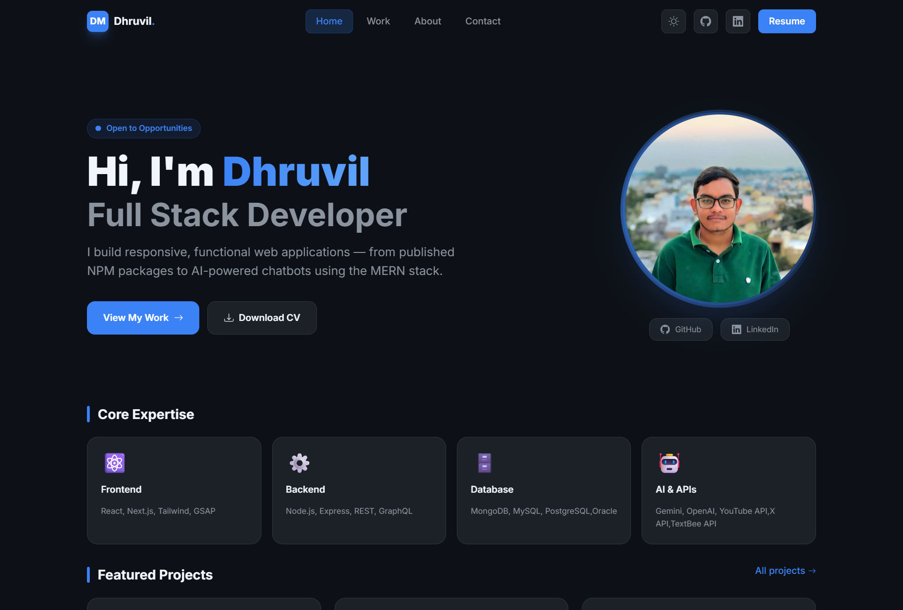

# Dhruvil Mistry — Portfolio

> **Full Stack Developer** | MERN Stack · Next.js · AI Integrations

A modern, dark-themed personal portfolio website built with **Next.js 16**, **TypeScript**, and **Tailwind CSS** — showcasing projects, skills, experience, and a downloadable resume.

---

## 🖥️ Preview



---

## ✨ Features

- ⚡ **Next.js 16 App Router** with TypeScript for type-safe, performant pages
- 🎨 **Dark-themed design** with a custom Tailwind color system and glassmorphism accents
- 🎞️ **Framer Motion** animations — staggered entrance effects on every section
- 📱 **Fully responsive** — mobile-first, looks great on all screen sizes
- 🔗 **Multi-page routing** — Home, Work, About, and Contact pages
- 📄 **Downloadable Resume** — one-click CV download from the hero and footer
- 🌐 **SEO-ready** — Open Graph metadata, semantic HTML, and descriptive page titles
- 🖼️ **Optimized images** via `next/image` with priority loading for the profile photo
- 🔤 **Inter font** loaded via Google Fonts for clean, modern typography

---

## 🛠️ Tech Stack

| Layer | Technology |
|---|---|
| **Framework** | Next.js 16 (App Router) |
| **Language** | TypeScript |
| **Styling** | Tailwind CSS v3 |
| **Animations** | Framer Motion |
| **Icons** | React Icons |
| **Font** | Inter (Google Fonts) |
| **Linting** | ESLint (Next.js config) |
| **Deployment** | Vercel |

---

## 📄 Pages

| Page | Route | Description |
|---|---|---|
| Home | `/` | Hero section, Core Expertise cards, Featured Projects, CTA |
| Work | `/work` | Full project showcase with tech tags and GitHub links |
| About | `/about` | Bio, Skills grid, Education, and Work Experience timeline |
| Contact | `/contact` | Contact form and social links |

---

## 🚀 Projects Showcased

| Project | Tech | Highlights |
|---|---|---|
| **SMS-Dispatch NPM Package** | Node.js, NPM, TextBee API | Published NPM package · 50+ SMS templates · ⭐ 2 stars |
| **YouTube AI Notifier** | Gemini API, YouTube API, Nodemailer | Cron-based monitoring · AI-generated email summaries |
| **Bank Transaction System** | MERN, JWT, Bcrypt | Secure auth · Full account & transaction API |
| **MindSpark AI Chatbot** | React, Gemini API, MongoDB | AI-powered student assistant · ⭐ 2 stars |
| **Todo App** | React, Vite, Tailwind | Dark mode · Fast rendering · ⭐ 1 star |

---

## 🧑‍💻 Getting Started

### Prerequisites

- **Node.js** v18+ and **npm** (or pnpm / yarn / bun)

### Installation

```bash
# 1. Clone the repository
git clone https://github.com/dhruvil0203/dk-portfolio.git
cd dk-portfolio

# 2. Install dependencies
npm install

# 3. Start the development server
npm run dev
```

Then open [http://localhost:3000](http://localhost:3000) in your browser.

### Available Scripts

```bash
npm run dev      # Start local dev server (Turbopack)
npm run build    # Build production bundle
npm run start    # Serve production build
npm run lint     # Run ESLint
```

---

## 📁 Project Structure

```
dk-portfolio/
├── public/                 # Static assets (profile image, resume PDF, favicon)
├── src/
│   ├── app/
│   │   ├── page.tsx        # Home page
│   │   ├── work/           # Work / Projects page
│   │   ├── about/          # About page
│   │   ├── contact/        # Contact page
│   │   ├── layout.tsx      # Root layout (Header, Footer, metadata)
│   │   └── globals.css     # Global styles and Tailwind theme
│   ├── components/
│   │   ├── Header.tsx      # Sticky nav with mobile menu
│   │   ├── Footer.tsx      # Footer with quick links and contact
│   │   ├── PageHeader.tsx  # Reusable page title banner
│   │   ├── BottomNav.tsx   # Mobile bottom navigation
│   │   └── TabTitle.tsx    # Dynamic document title per route
│   └── lib/
│       └── data.ts         # All content data (profile, projects, skills)
├── tailwind.config.js      # Custom color tokens and theme config
├── next.config.ts          # Next.js configuration
└── tsconfig.json           # TypeScript configuration
```

---

## 🌍 Deployment

This project is optimized for **Vercel** — zero-config deployment:

1. Push the repository to GitHub
2. Import the project at [vercel.com/new](https://vercel.com/new)
3. Vercel auto-detects Next.js and deploys instantly

For other platforms (Netlify, Railway, etc.), run `npm run build` and serve the `.next` output.

---

## 📬 Contact

**Dhruvil Mistry**

- 📧 [dkmistry0203@gmail.com](mailto:dkmistry0203@gmail.com)
- 💼 [LinkedIn](https://www.linkedin.com/in/dhruvil-mistry-aba47b259/)
- 🐙 [GitHub](https://github.com/dhruvil0203)
- 📍 Nadiad, Gujarat, India

---

<p align="center">Built with ♥ by <strong>Dhruvil Mistry</strong></p>
